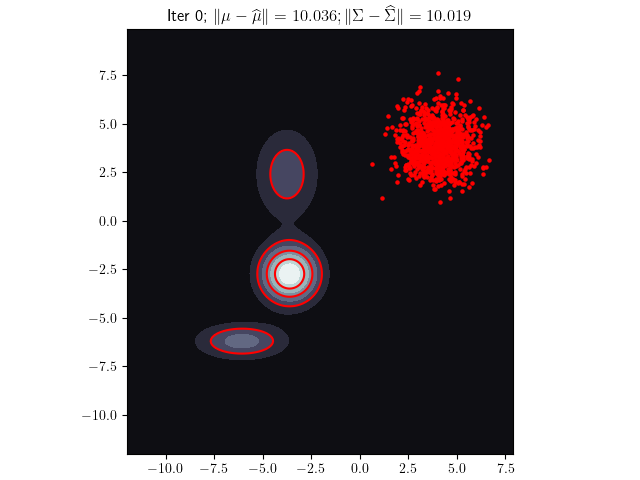
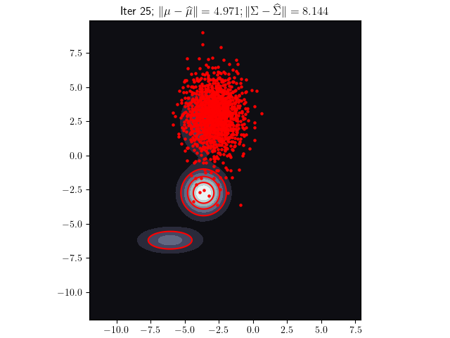
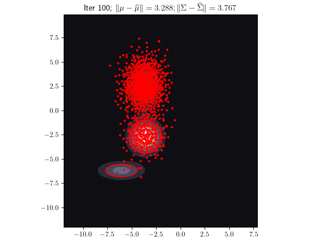
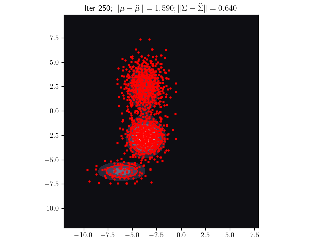
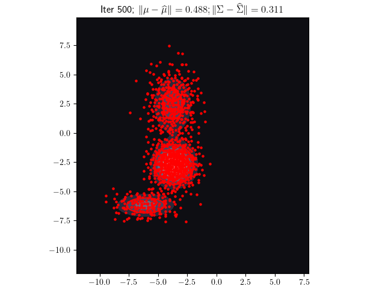

# Markov Chain Cubature for Bayesian Inference

This repository contains code for simulating Markov chains as a cloud of particles using cubature formulae.

The `presentation` folder contains slides describing the methodology.

The `scripts` folder contains the code.

# Examples

## 2D Gaussian Mixture

This will run the cubature algorithm on a 2D Gaussian mixture:

 ```shell
  python gmm_cubature.py
 ``` 
 
Outputting something like

 ```shell
 Time: 18.5 seconds
Number of particles:  1024

Cubature mean vector
[-4.13376   -1.8908577]

Cubature covariance matrix
[[ 2.31224477  1.89332097]
 [ 1.89332097 10.73603521]]

Actual mean vector
[-4.148839  -1.8847313]

Actual variances
[2.2467885 10.953863]

Difference in means
0.016276047
```

An illustration of the resulting particle configurations is given below:

<p align="middle">
    
    
    
</p>

<p align="middle">
    
    
    
</p>

 ## Bayesian Logistic Regression	
 
This runs the algorithm for a Bayesian logistic regression on a binary Covertype dataset (see [SVGD paper](https://proceedings.neurips.cc/paper/2016/file/b3ba8f1bee1238a2f37603d90b58898d-Paper.pdf) for details):

 ```shell
 python bayesian_logisitc_regression_cubature.py
 ```
 
Outputting something like
 ```shell
Time: 1137.0 seconds
Number of particles:  256
[accuracy, log-likelihood]
[0.7573040282953107, -0.5628809048706431]
 ```
The content of markov_chain_cubature_presentation.pdf is licensed under the Creative Commons Attribution 4.0 International license, and the Python code is licensed under the MIT license.